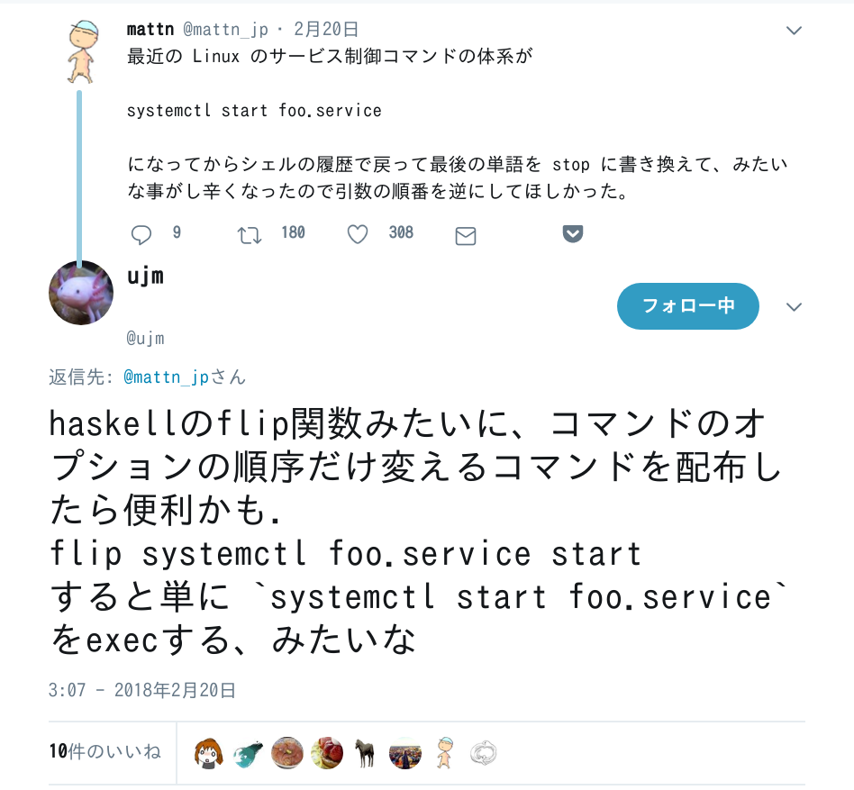

[](https://hackage.haskell.org/package/flip-cmd)

# :gift: How to install this :gift:
## From source
```shell-session
$ git clone https://github.com/aiya000/hs-flip-cmd
$ cd hs-flip-cmd
$ stack install  # the `flip` command will be installed to your ~/.local/bin
```


# :notes: Usage :notes:
```shell-session
$ flip echo 2 1 3
1 2 3
$ flip exit 1
$ echo $?
1
```
